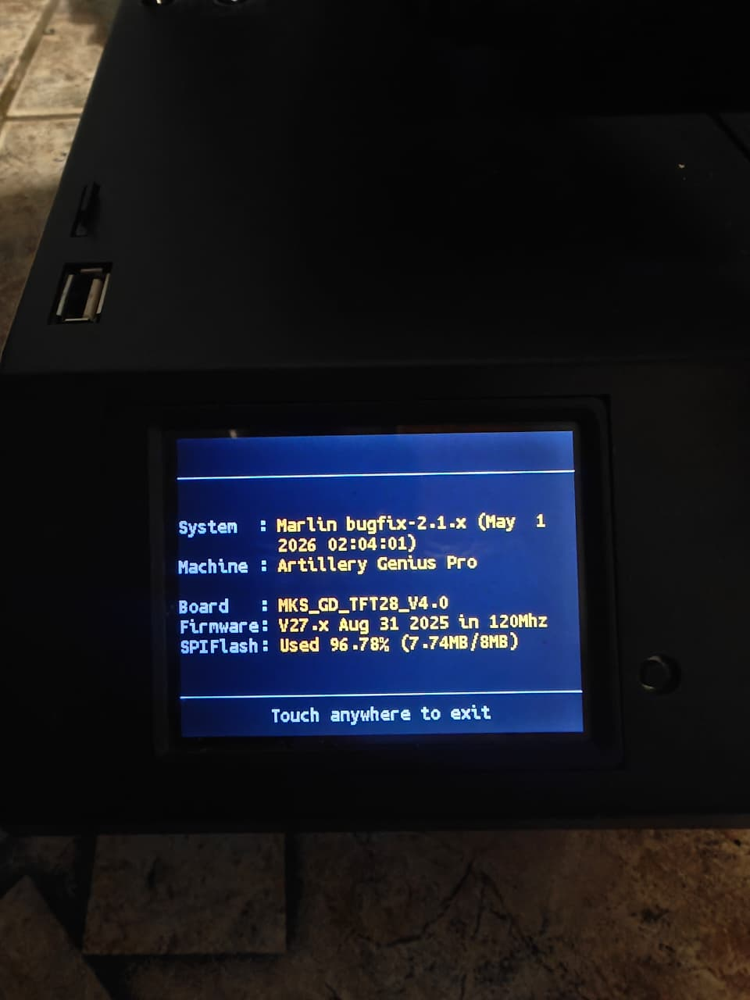

# TFT Screen Firmware Upgrade — Artillery Genius Pro

> **Recommended.** The Artillery Genius Pro ships with an outdated TFT firmware that lacks support for many features enabled in this Marlin build (host actions, M73 progress bar, proper filament change prompts, UBL mesh visualizer, etc.). This guide upgrades it to the latest community-maintained version.

> [!WARNING]
> **Verify your screen chip before proceeding.** The Artillery Genius Pro may ship with either a **GD32F305** or an **STM32** variant of the TFT28. The files in this guide are for the **GD32F305 only**. Flashing the wrong binary will brick your screen. **Do not continue until you have confirmed your chip.**

---

## Step 0 — Verify Your Screen Chip

**You must do this before flashing anything.**

### How to check

**Option A — TFT info screen (easiest):**

1. On your TFT touchscreen, go to **Menu → Settings → About** (or **Screen Info**, depending on your current firmware version)
2. The chip name is displayed — look for `GD32F305` or `STM32F207`



**Option B — Boot screen:**

Some firmware versions briefly show the chip identifier during boot. Power-cycle the printer and watch the TFT boot screen for a chip name.

**Option C — Physical inspection (last resort):**

Power off and look at the chip on the TFT PCB. The largest IC on the board will be labelled `GD32F305` or `STM32F207` (or similar STM32 part number).

### What to do based on your result

| Chip found | Action |
|-----------|--------|
| `GD32F305` | You can proceed with this guide |
| `STM32F207` or any other STM32 | **Do NOT use these files.** Look for STM32-specific TFT firmware for your screen size at [kisslorand/BTT-TFT-FW](https://github.com/kisslorand/BTT-TFT-FW) |
| Unsure / can't identify | **Stop. Do not flash anything until confirmed.** Ask in the Artillery community or open an issue in this repo |

---

## Overview

There are two separate steps. Do them **in order**:

1. **Upgrade the bootloader** to v3.0.5 (one-time — only needed if you haven't done this before)
2. **Update the TFT firmware** to the latest version

---

## Step 1 — Upgrade the Bootloader to v3.0.5

This is a one-time operation. The bootloader v3.0.5 is required for the new firmware to work correctly on the GD32F305 chip.

**Files needed** (from [`releases/tft/bootloader/`](bootloader/)):
- `MKSTFT28EVO.bin`
- `mks_config.txt`

**How to flash:**

1. Format a microSD card as **FAT32** (≤32 GB, allocation unit 4096 bytes)
2. Copy both files to the **root** of the SD card:
   ```
   SD root/
     MKSTFT28EVO.bin
     mks_config.txt
   ```
3. Power off the printer
4. Insert the SD card into the **TFT screen's SD slot** (the small slot on the side of the screen — not the mainboard slot)
5. Power on — the screen will show a progress bar while flashing
6. When complete, the screen will reboot into the normal UI
7. Remove the SD card

> The bootloader flash only takes a few seconds. If nothing happens, check that the SD card is FAT32 and that the files are in the root (not in a subfolder).

---

## Step 2 — Update the TFT Firmware

This updates the TFT's operating firmware to the latest version, built specifically for the Artillery Genius Pro.

**Files needed:**

| Source | File | Where to put it on the SD card |
|--------|------|-------------------------------|
| [`releases/tft/firmware/`](firmware/) | `MKSTFT28EVO.bin` | SD root |
| [`releases/tft/firmware/`](firmware/) | `config.ini` | SD root |
| Your choice (see below) | `language_XX.ini` | SD root |
| Your choice (see below) | `TFT28/` folder | SD root |

**How to flash:**

1. Use the same FAT32 SD card (or reformat it)
2. Copy `MKSTFT28EVO.bin` and `config.ini` to the SD root
3. Add your chosen language file and theme folder (see sections below)
4. Your SD card root should look like:
   ```
   SD root/
     MKSTFT28EVO.bin
     config.ini
     language_XX.ini       ← your chosen language
     TFT28/                ← your chosen theme
       bmp/
       font/
   ```
5. Insert into the **TFT screen's SD slot**, power on
6. The screen flashes each component (firmware, fonts, icons) in sequence — takes ~30 seconds
7. When complete it reboots into the updated UI
8. Remove the SD card

---

## Choosing a Language

Download a language file from the kisslorand BTT-TFT-FW repository:

**[kisslorand/BTT-TFT-FW — Copy to SD Card root directory to update](https://github.com/kisslorand/BTT-TFT-FW/tree/main/Copy%20to%20SD%20Card%20root%20directory%20to%20update)**

In that folder you'll find files named `language_XX.ini` where `XX` is the language code:

| File | Language |
|------|----------|
| `language_en.ini` | English |
| `language_es.ini` | Spanish |
| `language_fr.ini` | French |
| `language_de.ini` | German |
| `language_pt.ini` | Portuguese |
| `language_it.ini` | Italian |
| `language_ru.ini` | Russian |
| `language_zh_CN.ini` | Chinese Simplified |
| `language_zh_TW.ini` | Chinese Traditional |
| `language_ja.ini` | Japanese |
| and more… | Browse the repo for the full list |

Download the file for your language and place it in the SD root alongside `MKSTFT28EVO.bin`.

---

## Choosing a Theme

Themes control the icons and color scheme of the touch interface. Each theme is a `TFT28/` folder with `bmp/` (icons) and `font/` (fonts) subfolders.

Browse and download themes from the same repository:

**[kisslorand/BTT-TFT-FW — Copy to SD Card root directory to update](https://github.com/kisslorand/BTT-TFT-FW/tree/main/Copy%20to%20SD%20Card%20root%20directory%20to%20update)**

Look for folders named after themes (e.g. `TFT28/`, or theme-specific variants). Download the entire `TFT28/` folder of your chosen theme and place it in the SD root.

> **Tip:** you can change themes at any time by re-flashing with a different `TFT28/` folder. You don't need to reflash the firmware binary again — just put `TFT28/` on the SD card and power on.

---

## About the `config.ini`

The `config.ini` included in [`releases/tft/firmware/`](firmware/) is pre-configured for the Artillery Genius Pro:

| Setting | Value | Reason |
|---------|-------|--------|
| `serial_port` | P1:6 | Correct UART port for the Ruby board |
| `size_max` | X220 Y220 Z250 | Genius Pro build volume |
| `hotend_count` | 1 | Single extruder |
| `heated_bed` | 1 | Heated bed present |
| `onboard_sd` | 2 | Uses mainboard SD (onboard) |
| `emulated_m600` | 1 | TFT handles filament change UI |
| `auto_load_leveling` | 1 | Auto-enable UBL mesh after homing |
| `long_filename` | 2 | Full long filename support |
| `pause_pos` | X10 Y10 | Park position during pause |
| `M27_always_active` | 1 | Continuous SD status polling |

You can edit this file in a text editor before flashing if you want to adjust any settings.

---

## Troubleshooting

**Screen is blank after bootloader flash**
- Wait 10 seconds, then power cycle. If still blank, try the flash again with a freshly formatted SD card.

**Icons missing or corrupt after firmware update**
- The `TFT28/` folder may be incomplete or from a different screen size. Re-download it from the kisslorand repo and reflash (just the `TFT28/` folder, no need to repeat the binary flash).

**Wrong language on screen**
- Re-flash with the correct `language_XX.ini` on the SD root (binary is not needed again).

**TFT shows "No printer attached" or communication errors**
- Ensure the Marlin firmware is also flashed (see [releases/v7/README.md](../v7/README.md)). The TFT communicates with Marlin over serial — it won't connect without compatible Marlin firmware running on the mainboard.

**Bootloader step was skipped**
- If you flashed the firmware but the bootloader is still old, the screen may work but with reduced stability. Re-do Step 1 to upgrade the bootloader.
